# Docker

Prof. Jinwoo Jang
System Programming Lab.

---

## Why Use Docker?

- We want to easily deploy our implementation to a variety of systems.
- **We need a virtual space (No more VM, too slow).**


---

## Docker vs. Virtual Machine

- OS = kernel + filesystem/libraries
- Image = filesystem/libraries

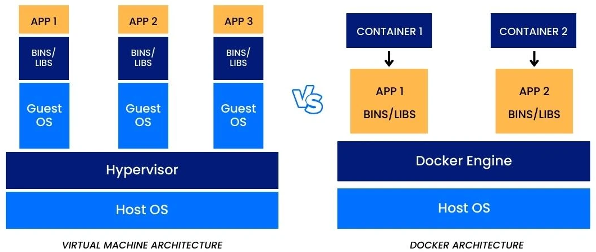

---

## Install Docker (Windows)

- Go to [https://docs.docker.com/engine/install/](https://docs.docker.com/engine/install/)
- Click **_Docker Desktop for Windows_**

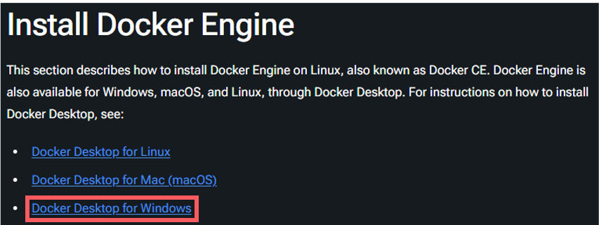

---

## Install Docker (Windows)

- Click **_Docker Desktop for Windows - x86_64_**
- We recommend checking that your computer's architecture is x86_64 (but it will most likely be x86_64)

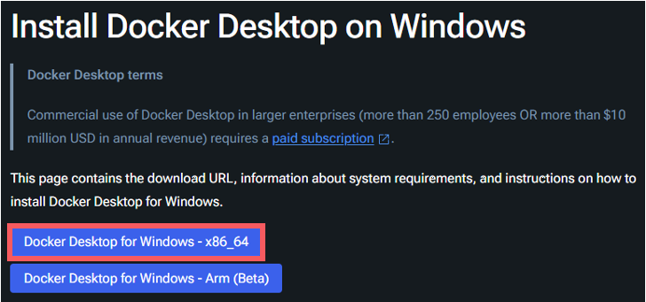

---

## Install Docker (Windows)

- Open the downloaded installer
- **Summary**: Click **_OK_**, **_Install_**, and **_Close!_**
- After closing the window, reboot (or logout and login) your OS

---

## Install Docker (Windows)

- If you don't want to create a shortcut on your desktop, unckeck that option

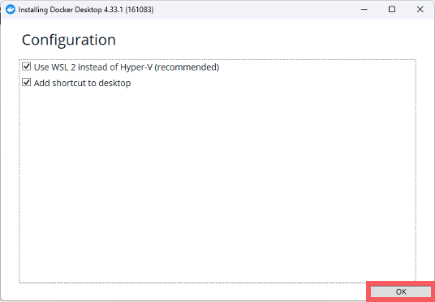

---

## Install Docker (Windows)

- After you clicke the _Close and log out_ button, your OS will automatically log you out

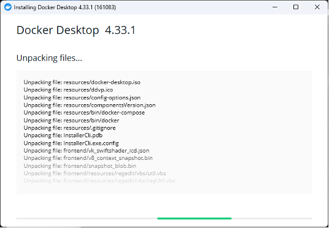
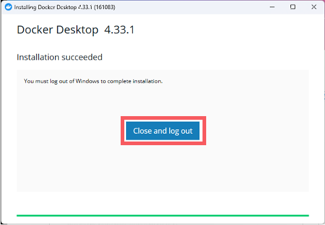

---

## Install Docker (Windows)

- Accept the _Docker subscription service agreement_


---

## Install Docker (Windows)

- Skip login or login to Docker if you have an account

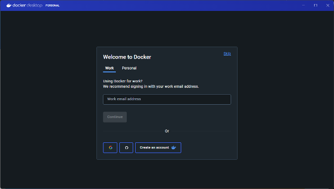

---

## Install Docker (Mac)

- Before installing, you need to check whether your Mac architecture is _Arm_ or _x86_
- Click **_Apple icon()_** → **_About This Mac(이 맥에 관하여)_**
- Check what your **_processor_**(칩) is
  - Apple M1, Apple M2 Pro, Apple M3 Max, etc. → **_Arm_**
  - 1.4GHz Intel Core i5, 2.3GHz Intel Core i9, etc. → **_x86_**

---

## Install Docker (Mac)

- Go to [https://docs.docker.com/engine/install/](https://docs.docker.com/engine/install/)
- Click **_Docker Desktop for Mac (macOS)_**

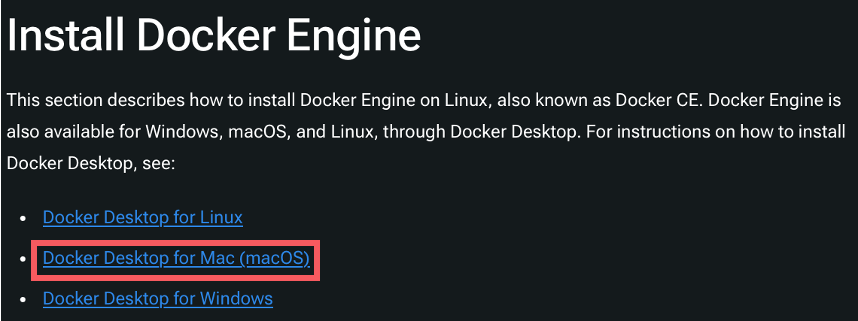

---

## Install Docker (Mac)

- If your Mac is **_Arm_**, click **_... with Apple Silicon_**
- If your Mac is **_x86_**, click **_... with Intel Processor_**

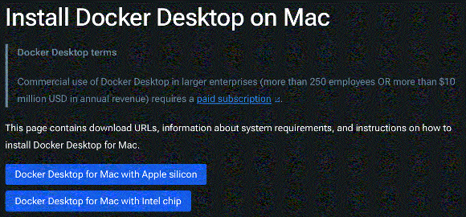

---

## Install Docker (Mac)

- Open _Docker.dmg_ file
- Drag and drop the Docker icon to the Applications folder

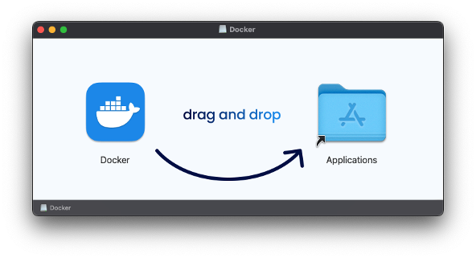

---

## Install Docker (Mac)

- Accept the _Docker subscription service agreement_


---

## Install Docker (Mac)

- Skip login or login to Docker if you have an account


---

## Setup Docker

- Search **_`csilab/spl`_** and run this image

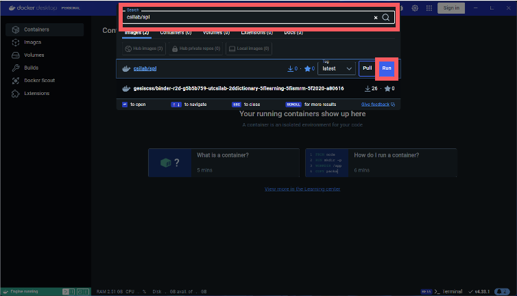

---

## Setup Docker

- Change **_copntainer name_** and click **_Run_** button

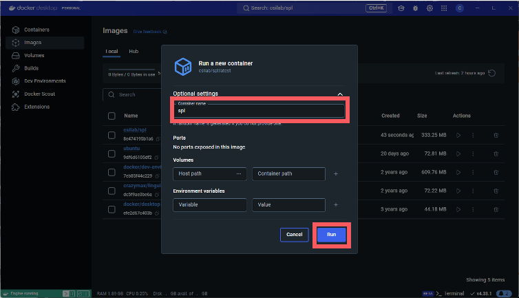

---

## Setup Docker

- Go to **_Exec_**(or _Terminal_) tab and you may find the terminal window

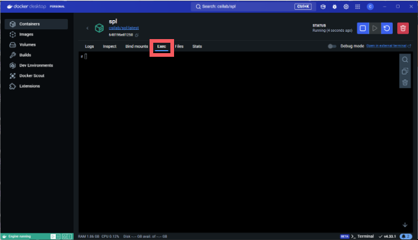

---

## Exercise

- Check _`gcc`_ version (type _`gcc --version`_)

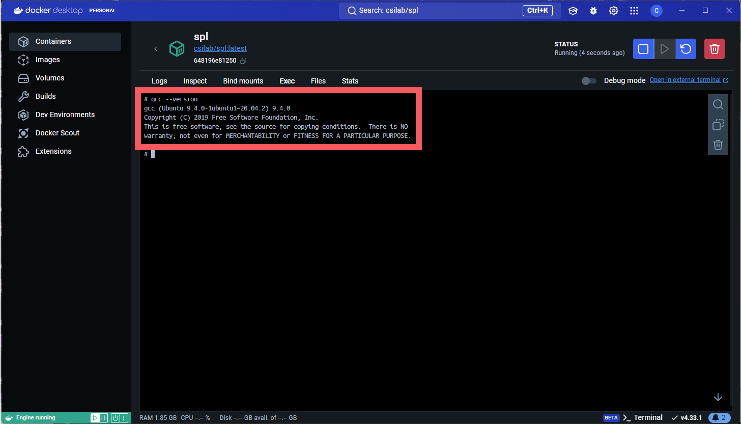

---

## Exercise

- Add a new user
  - Type _`adduser s2024######`_ (replace _`2024######`_ with your student ID)
  - Type your _password_ and type it again
  - Type _Enter_, _Enter_, _Enter_, _Enter_, and _Enter_ again
  - Type _Y_ and _Enter_
- Make the new user a sudoer
  - Type _`usermod -aG sudo s2024######`_ (replace _`2024######`_ with your student ID)
- Login to the new user
  - Type _`su - s2024######`_ (replace _`2024######`_ with your student ID)
  - Type your _password_

---

## Exercise

- Check _`gcc`_ version again, as the new user

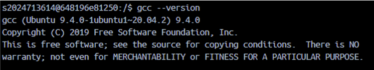

---

## Caution!

- Please **_DO NOT erase your container_**
- If you erase your container, you will lose all your data (_even your codes!_)

---

## Run in External Terminal (optional)

- If you want to run the container in an external terminal (iTerm2, Hyper, etc.), you can do the following:
  - _`docker exec -it spl /bin/bash`_
- You can login to the new user you've just created before
  - _`su s2024######`_ (replace _`2024######`_ with your student ID)

---

## Build Image from Scratch (optional)

- Search _`ubuntu:20.04`_
- Pull and run the container

---

## Build Image from Scratch (optional)

- Type below commands

```bash
apt update -y
apt upgrade -y
apt install sudo curl wget htop -y
apt install gcc-9 g++-9 -y
update-alternatives --install /usr/bin/gcc gcc /usr/bin/gcc-9 9
update-alternatives --install /usr/bin/g++ g++ /usr/bin/g++-9 9
update-alternatives --set gcc /usr/bin/gcc-9
update-alternatives --set g++ /usr/bin/g++-9
```
